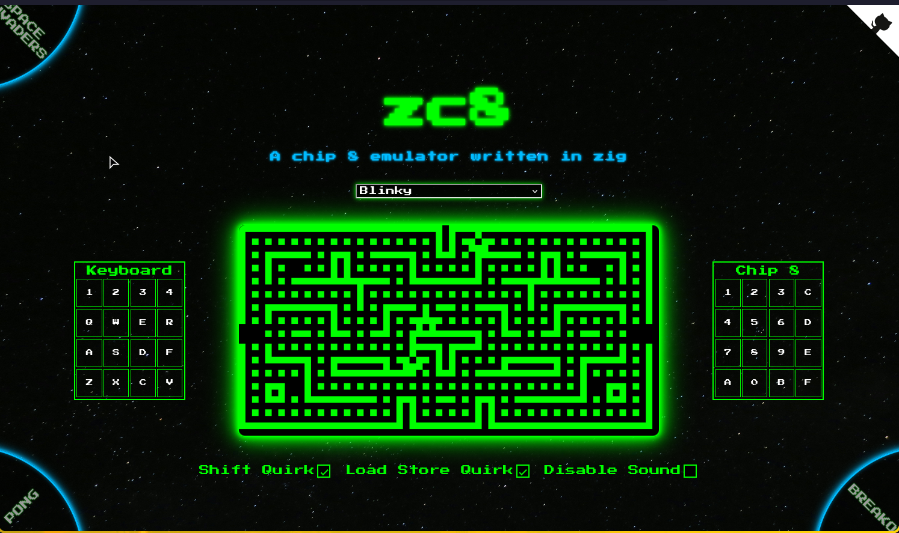
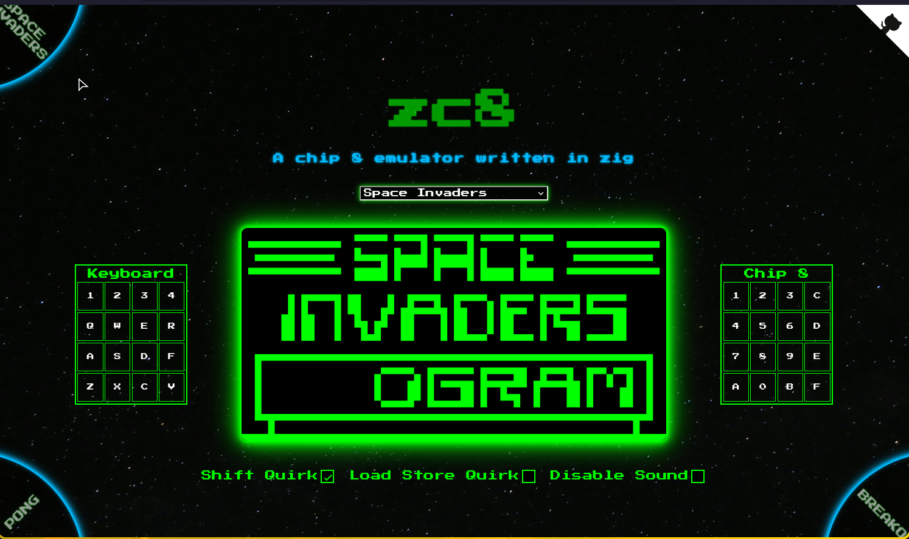

# zc8


zc8 is a lightweight Chip-8 emulator implemented in Zig, designed to provide a clean and minimal implementation of the classic Chip-8 virtual machine. It is well-suited for experimentation, and running retro games.

The emulator is compiled to WebAssembly using Emscripten, allowing it to run directly in the browser. SDL3 is used for handling graphics and input and sound.

This project was developed as a way to gain hands-on experience with Zig, WebAssembly, Emscripten, and emulator development.

## Screenshots

|                      |          |
| :--------------------------------------------: | :------------------------------------: |
|  |  |

## Building zc8

### Setting Up Dependencies

#### NixOS
```bash
nix develop
```

> [!NOTE]  
> To Resolve the emscripten cache issue : [https://github.com/NixOS/nixpkgs/issues/139943#issuecomment-930432045](https://github.com/NixOS/nixpkgs/issues/139943#issuecomment-930432045)

#### Non NixOS

- [Setting Up Emscripten](https://emscripten.org/docs/getting_started/downloads.html)
- [Setting Up Zig](https://ziglang.org/learn/getting-started/)

### Compiling zc8

```
zig build -Dtarget=wasm32-emscripten -Doptimize=Debug --sysroot "$(em-config CACHE)/sysroot"
```

- Copy over the `zc8.js` and `zc8.wasm` to `website` directory and run `emrun index.html` inside website directory 

### Running Tests
```bash
zig build test --summary all
```

## Resources
- [Guide To Making A CHIP-8 Emulator](https://tobiasvl.github.io/blog/write-a-chip-8-emulator/)
- [Revisiting Chip 8](https://faizilham.github.io/revisiting-chip8)
- [CHIP-8 Research Facility](https://chip-8.github.io/)
- [Cowgod's Chip-8 Technical Reference](http://devernay.free.fr/hacks/chip8/C8TECH10.HTM)
- [https://github.com/castholm/SDL](https://github.com/castholm/SDL)
- [SDL3 Example: audio/03-load-wav](https://examples.libsdl.org/SDL3/audio/03-load-wav/)
- [Emscripten: Interacting With Code](https://emscripten.org/docs/porting/connecting_cpp_and_javascript/Interacting-with-code.html)
- [Octo : A Chip 8 IDE](https://johnearnest.github.io/Octo/)
- [chip-8-test-suite](https://github.com/Timendus/chip8-test-suite)
- [chip-8-test-rom](https://github.com/corax89/chip8-test-rom)
- [Chip-8-Archive](https://johnearnest.github.io/chip8Archive/)
- [Chip-8-Roms](https://github.com/kripod/chip8-roms)
- [Building a CHIP-8 Emulator - C++](https://austinmorlan.com/posts/chip8_emulator/)

### Website Design Ideas

- [RCA COSMAC VIP is working :)](https://www.reddit.com/r/vintagecomputing/s/VXSFP08Yhc)
- [Chip-8-Gallery](https://www.cosmacvip.com/GALLERY/GALLERY.php)
- [Poolsuite.net](https://poolsuite.net/)
- [WinZip-1997](https://webflow.com/made-in-webflow/website/winzip-1997)

## Contributing

Pull requests are welcome. For major changes, please open an issue first
to discuss what you would like to change.

Please make sure to update tests as appropriate.

## License

[MIT](https://choosealicense.com/licenses/mit/)
